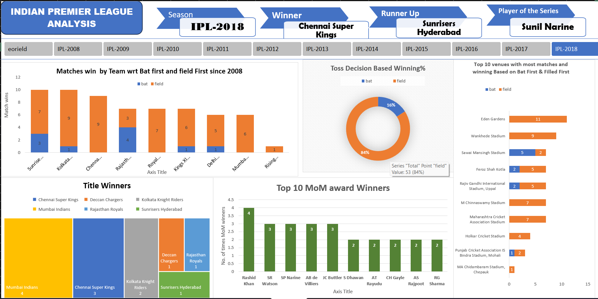

# IPL-Dashboard-analysis

The objective of this project is to analyze Indian Premier League (IPL) match data (2008-2018 by creating an interactive Excel dashboard using Pivot Tables, Slicers, and Data Visualization techniques. It aims to extract key insights into team performance, player achievements, toss impact, and venue trends, enhancing data-driven decision-making. This project also demonstrates business intelligence concepts, improving data analytics, visualization, and dashboard creation skills for real-world applications in sports analytics and business intelligence.

## Tools Used
- Microsoft Excel
- Pivot Tables
- Charts
- Data Cleaning
- Dashboard Creation

## Dashboard Preview

## Key Insights
- Identified top-performing products
- Analyzed monthly sales trends
- Compared regional performance
- Created interactive dashboard

## Files Included
- Sales-Data.xlsx → Raw dataset and analysis
- Dashboard.png → Dashboard preview

## Skills Demonstrated
- Data Cleaning
- Data Analysis
- Dashboard Creation
- Business Insights

## Author
Satakshi Rawat

Questions (KPI's)
Total matches won by each team

Win percentage when batting first vs. chasing

Top 10 Man of the Match (MOM) award winners

Impact of toss decisions on match outcomes

Venue-wise win percentage

Future Improvements
• Integrate Power BI for enhanced interactivity and real-time data connections.

• Apply SQL to query and manipulate large datasets efficiently.

• Use Python for Data Analysis to perform deeper statistical analysis.

This project marks the beginning of my data analytics journey, and I am excited to learn and grow in this field!
